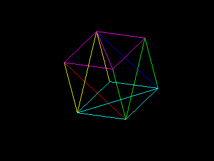
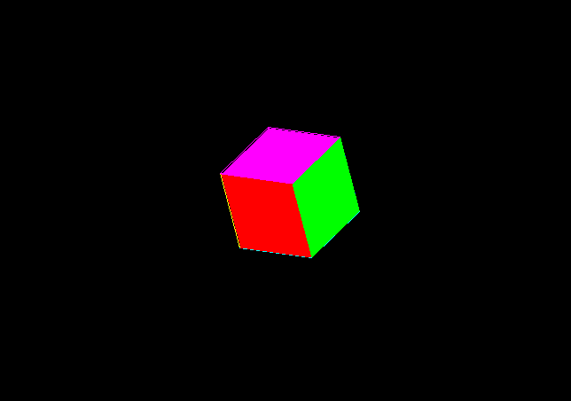

# Python_3d_cube_render

this is a work in progress project where i try to render a cube in python using pygame
  
move the cube around with W,A,S,D,Q,E and press f to fill it with color

  
fill will cause lag becouse the algo i used for it is a bit bad

